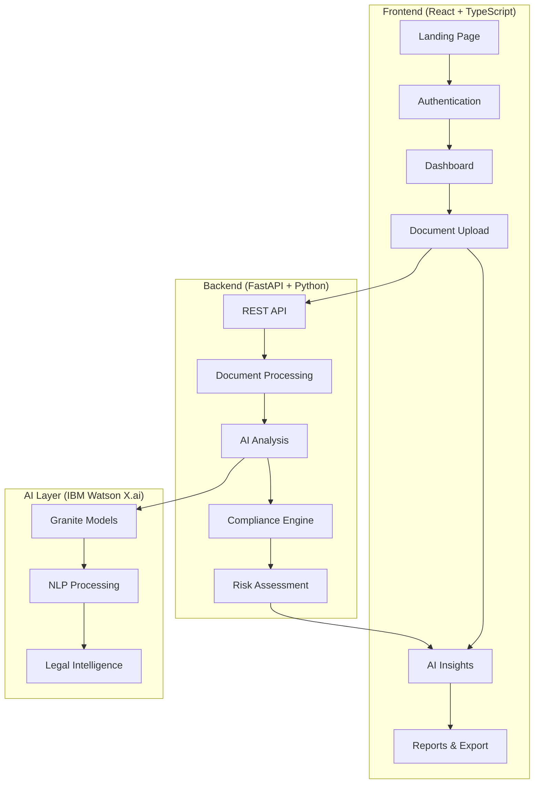
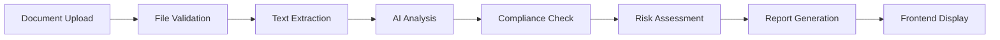

# Litigator's Lens

## 🚀 Tech Stack

[](https://fastapi.tiangolo.com/)
[](https://reactjs.org/)
[](https://www.typescriptlang.org/)
[](https://python.org/)

---

## 🎯 Project Vision

**Litigator's Lens** transforms how businesses navigate complex legal landscapes by providing AI-powered document analysis, compliance checking, and regulatory intelligence. Built for the IBM TechXchange Hackathon, this platform makes legal expertise accessible to organizations of all sizes.

### 🏆 Why This Matters
- **70%** of businesses struggle with compliance due to complex legal language
- **$14.8 billion** lost annually due to regulatory non-compliance
- **Small businesses** can't afford dedicated legal teams
- **Legal documents** are getting more complex every year

---

## ✨ Key Features

### 🤖 **AI-Powered Document Intelligence**
- **Smart Summarization**: Convert complex legal jargon into plain English
- **Clause Explanation**: Real-time explanation of contract terms and implications
- **Risk Assessment**: Automated identification of potential compliance issues
- **Multi-format Support**: PDF, DOCX, TXT document processing

### 📊 **Compliance Engine**
- **Multi-Jurisdiction Support**: GDPR (EU), PDPA (MY/SG), CCPA (US), Employment Act (MY)
- **Real-time Compliance Checking**: Instant validation against regulatory frameworks
- **Risk Scoring**: Quantified compliance risk assessment (0-100 scale)
- **Regulatory Alerts**: Proactive identification of compliance gaps

### 💼 **Enterprise-Grade Features**
- **Export Capabilities**: PDF reports for stakeholder sharing
- **RESTful API**: Easy integration with existing systems
- **Comprehensive Documentation**: Auto-generated API docs with OpenAPI/Swagger

### 🌍 **Regional Legal Intelligence**
- **Malaysia**: PDPA 2010, Employment Act 1955
- **Singapore**: PDPA 2012
- **European Union**: GDPR 2018
- **United States**: CCPA 2020

---

## 🏗️ Technical Architecture

### **Backend Stack**
```
🐍 Python 3.12+ with FastAPI
🧠 IBM Watson X.ai (Granite Models)
📄 Advanced Document Processing (PDFPlumber, python-docx)
🔍 Intelligent Text Analysis & NLP
🗄️ JSON-based Regulatory Database
```

### **Frontend Stack**
```
⚛️ React 18 with TypeScript
🎨 Modern UI with Tailwind CSS & Radix UI Components
📱 Responsive Design for All Devices
📊 Interactive Data Visualizations (Recharts)
🔄 Real-time API Integration with Axios
🎯 React Router for SPA Navigation
💾 Zustand for State Management
📂 React Dropzone for File Uploads
🎨 Lucide React Icons
```

### **AI & Machine Learning**
```
🤖 IBM Watson X.ai Integration
🧬 Granite Foundation Models
🔤 Natural Language Processing
📊 Semantic Analysis & Understanding
🎯 Context-Aware Risk Assessment
```

---

## 🎨 Frontend & User Experience

### **Modern Web Application Architecture**
Our frontend is built as a sophisticated Single Page Application (SPA) that delivers a seamless, responsive experience across all devices. The application leverages modern React patterns and TypeScript for type safety and maintainability.

### **🖥️ User Interface Highlights**

#### **Professional Dashboard**
- **Real-time Analytics**: Live compliance statistics and document processing metrics
- **Interactive Charts**: Visual representation of risk scores and compliance trends using Recharts
- **Quick Actions**: One-click access to document analysis and AI insights
- **Activity Feed**: Recent analysis history and compliance alerts

#### **Intelligent Document Analysis Interface**
- **Dual-Mode Processing**: Switch between file upload and direct text input
- **Drag & Drop Upload**: Modern file upload with progress indicators and validation
- **Multi-Format Support**: PDF, DOCX, TXT with real-time file validation
- **Live Progress Tracking**: Visual feedback during document processing

#### **AI-Powered Insights Panel**
- **Smart Summarization**: Three summary types (Plain Language, Executive, Risk Analysis)
- **Clause Explanation**: Real-time legal clause interpretation with risk assessment
- **Interactive Results**: Expandable sections with detailed explanations and recommendations
- **Export Capabilities**: PDF report generation for sharing and documentation

### **🎯 Key UI Components**

| Component | Purpose | Features |
|-----------|---------|----------|
| **Landing Page** | First impression & onboarding | Hero section, feature showcase, call-to-action |
| **Authentication** | Secure user management | Login/signup with protected routes |
| **Dashboard** | Central hub | Analytics, quick stats, recent activities |
| **Document Analyzer** | Core functionality | File upload, text input, real-time analysis |
| **AI Insights** | Intelligence layer | Summarization, clause explanation, risk assessment |
| **Compliance Center** | Regulatory overview | Multi-jurisdiction compliance status |
| **Reports & Export** | Business intelligence | PDF generation, data visualization |

### **📱 Responsive Design System**

#### **Mobile-First Approach**
- **Adaptive Layouts**: Seamless experience from mobile to desktop
- **Touch-Optimized**: Finger-friendly interface elements
- **Progressive Enhancement**: Advanced features unlock on larger screens

#### **Design Language**
- **Dark Theme**: Modern, professional appearance that reduces eye strain
- **Gradient Backgrounds**: Sophisticated visual depth with subtle animations
- **Consistent Iconography**: Lucide React icons for clarity and recognition
- **Micro-Interactions**: Smooth hover effects and loading animations

### **⚡ Performance & User Experience**

#### **Fast & Responsive**
- **Code Splitting**: Lazy loading for optimal performance
- **Optimized Bundling**: Vite for lightning-fast development and builds
- **Caching Strategy**: Efficient API response caching
- **Error Boundaries**: Graceful error handling with user-friendly messages

#### **Accessibility Features**
- **Keyboard Navigation**: Full keyboard accessibility support
- **Screen Reader**: ARIA labels and semantic HTML
- **Color Contrast**: WCAG compliant color schemes
- **Focus Management**: Clear visual focus indicators

### **🔄 State Management & Data Flow**

#### **Modern State Architecture**
```typescript
// Zustand for global state management
interface AppState {
  user: User | null;
  analyses: Analysis[];
  compliance: ComplianceStatus;
  settings: UserSettings;
}

// React Query for server state
const { data, isLoading, error } = useQuery(
  ['analysis', analysisId],
  () => contractService.getAnalysis(analysisId)
);
```

#### **Real-time Updates**
- **Optimistic Updates**: Immediate UI feedback for better UX
- **Error Recovery**: Automatic retry with exponential backoff
- **Loading States**: Skeleton screens and progress indicators

---

## 🚀 Live API Endpoints

### **Core Document Analysis**
| Endpoint | Method | Description | Status |
|----------|--------|-------------|--------|
| `/contract/analyze` | POST | Analyze contract text for compliance | ✅ Live |
| `/contract/analyze/file` | POST | Upload & analyze document files | ✅ Live |
| `/contract/risk-score` | POST | Generate compliance risk scores | ✅ Live |
| `/contract/extract-text` | POST | Extract text from documents | ✅ Live |

### **AI-Powered Insights**
| Endpoint | Method | Description | Status |
|----------|--------|-------------|--------|
| `/ai/summarize` | POST | Generate plain-language summaries | ✅ Live |
| `/ai/explain-clause` | POST | Explain complex legal clauses | ✅ Live |
| `/ai/health` | GET | AI service health check | ✅ Live |

### **Regulatory Intelligence**
| Endpoint | Method | Description | Status |
|----------|--------|-------------|--------|
| `/regulations/` | GET | List all supported regulations | ✅ Live |
| `/regulations/{law_id}` | GET | Get specific regulation details | ✅ Live |
| `/regulations/search` | POST | Search regulations by criteria | ✅ Live |
| `/regulations/jurisdictions/list` | GET | Supported jurisdictions | ✅ Live |

### **UI Feature Showcase**
```bash
# Open the application and explore:
# 🏠 Landing Page - Professional marketing site
# 📊 Dashboard - Real-time analytics and insights
# 📄 Document Analyzer - File upload with drag & drop
# 🤖 AI Insights - Smart summarization and clause explanation
# 📋 Compliance Center - Multi-jurisdiction regulatory overview
# 📈 Reports - Interactive charts and PDF export
```

---

## 🎯 Use Cases

### **For Small Businesses**
- **Contract Review**: Upload vendor contracts and get instant plain-language summaries
- **GDPR Compliance**: Ensure EU customer data protection with automated checking
- **Employment Law**: Understand obligations under Malaysian Employment Act
- **Quick Risk Assessment**: Get compliance risk scores before signing agreements

### **For Legal Professionals**
- **Document Acceleration**: Process contracts 90% faster with AI-powered analysis
- **Client Communication**: Generate plain-language summaries for non-legal stakeholders
- **Multi-jurisdiction**: Handle cross-border compliance requirements efficiently

### **For Enterprises**
- **Regulatory Monitoring**: Proactive compliance tracking across multiple jurisdictions
- **Risk Management**: Quantified risk assessment with actionable recommendations
- **Report Generation**: Executive dashboards and PDF reports for stakeholders

### **Frontend User Journeys**

#### **Business Owner Journey**
1. **Landing Page**: Learn about compliance challenges and solutions
2. **Quick Signup**: Simple registration with email verification
3. **Dashboard**: Overview of compliance status and recent activities
4. **Upload Contract**: Drag & drop PDF employment contract
5. **Get Results**: Plain-language summary with risk assessment
6. **Export Report**: Download PDF for stakeholder review

#### **Legal Professional Journey**
1. **Jurisdiction Selection**: Choose relevant regulatory frameworks
2. **AI Analysis**: Get detailed compliance reports with clause explanations
3. **Risk Prioritization**: Focus on high-risk items first
4. **Client Reports**: Generate professional summaries for clients
5. **Compliance Tracking**: Monitor ongoing compliance status

---

## 🛠️ Technical Deep Dive

### **Full-Stack Architecture Overview**


### **Frontend Architecture**
```typescript
// Component Structure
src/
├── components/          # Reusable UI components
│   ├── layout/         # Header, Footer, Navigation
│   ├── forms/          # Form components with validation
│   └── charts/         # Data visualization components
├── pages/              # Route-level components
│   ├── Landing.tsx     # Marketing & onboarding
│   ├── Dashboard.tsx   # Analytics & quick actions
│   ├── Analyze.tsx     # Document upload & analysis
│   ├── AIInsights.tsx  # AI-powered summaries
│   └── Reports.tsx     # Export & visualization
├── services/           # API integration layer
│   ├── contractService.ts    # Document analysis APIs
│   ├── aiInsightsService.ts  # AI-powered features
│   └── regulatoryService.ts  # Compliance checking
└── utils/              # Helper functions & types
```

### **UI Component System**
```typescript
// Example: Smart Document Analyzer Component
interface DocumentAnalyzerProps {
  onAnalysisComplete: (result: AnalysisResult) => void;
  supportedFormats: string[];
  maxFileSize: number;
}

const DocumentAnalyzer: React.FC<DocumentAnalyzerProps> = ({
  onAnalysisComplete,
  supportedFormats,
  maxFileSize
}) => {
  // Drag & drop functionality
  const { getRootProps, getInputProps, isDragActive } = useDropzone({
    accept: supportedFormats,
    maxSize: maxFileSize,
    onDrop: handleFileUpload
  });

  // Real-time progress tracking
  const [uploadProgress, setUploadProgress] = useState(0);
  const [analysisStatus, setAnalysisStatus] = useState<AnalysisStatus>('idle');

  return (
    <div className="space-y-6">
      {/* File Upload Zone */}
      <div
        {...getRootProps()}
        className={`border-2 border-dashed rounded-lg p-8 text-center transition-colors ${
          isDragActive 
            ? 'border-blue-400 bg-blue-50' 
            : 'border-gray-300 hover:border-gray-400'
        }`}
      >
        {/* Upload UI */}
      </div>
      
      {/* Progress Indicators */}
      {uploadProgress > 0 && (
        <ProgressBar value={uploadProgress} status={analysisStatus} />
      )}
      
      {/* Results Display */}
      <ResultsPanel results={analysisResults} />
    </div>
  );
};
```

### **Document Processing Pipeline**


### **AI Analysis Workflow**
1. **Text Preprocessing**: Clean and structure document content
2. **Semantic Analysis**: Understand context and meaning using IBM Granite
3. **Regulatory Mapping**: Match content against legal frameworks
4. **Risk Calculation**: Quantify compliance risks and exposures
5. **Plain Language Translation**: Convert legal jargon to accessible language

### **Compliance Engine Logic**
- **Pattern Matching**: Identify regulatory clauses and requirements
- **Cross-Reference**: Compare document terms with legal standards
- **Gap Analysis**: Highlight missing or insufficient protections
- **Recommendation Engine**: Suggest improvements and modifications

---

## 🚀 Future Roadmap

### **Phase 1: Enhanced AI** (Q3 2025)
- Multi-language support (Bahasa Malaysia, Mandarin, Tamil)
- Advanced contract negotiation assistance
- Predictive compliance analytics
- **Enhanced UI**: Advanced data visualizations and interactive charts

### **Phase 2: Enterprise Features** (Q4 2025)
- Workflow integration (Slack, Teams, Email)
- Advanced reporting and dashboards
- Custom regulatory framework support
- **Mobile App**: Native iOS/Android applications
- **Collaboration Tools**: Team workspaces and shared analyses

### **Phase 3: Global Expansion** (Q1 2026)
- Additional jurisdictions (UK, Australia, Canada)
- Industry-specific compliance modules
- Real-time regulatory updates
- **AI Assistant**: Conversational AI for legal queries
- **API Marketplace**: Third-party integrations and plugins

---
